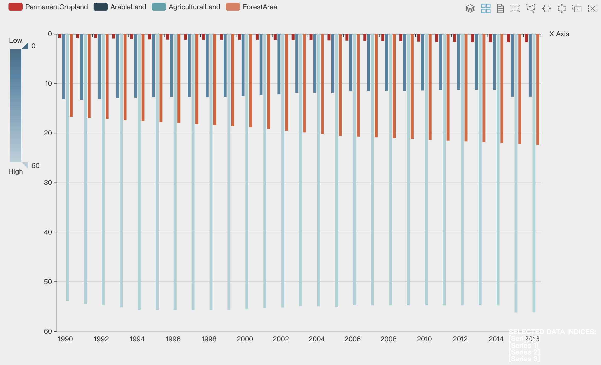
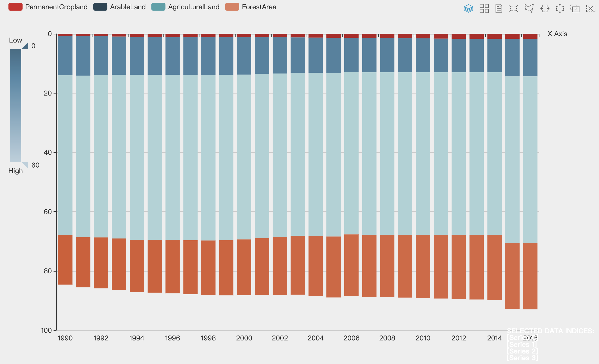
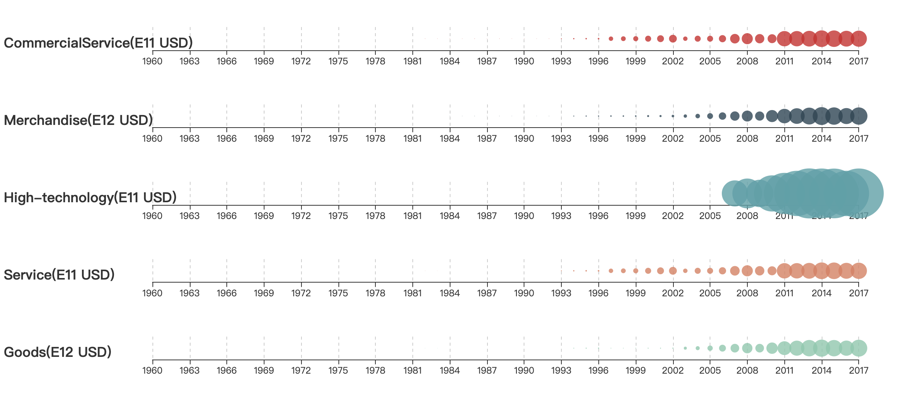
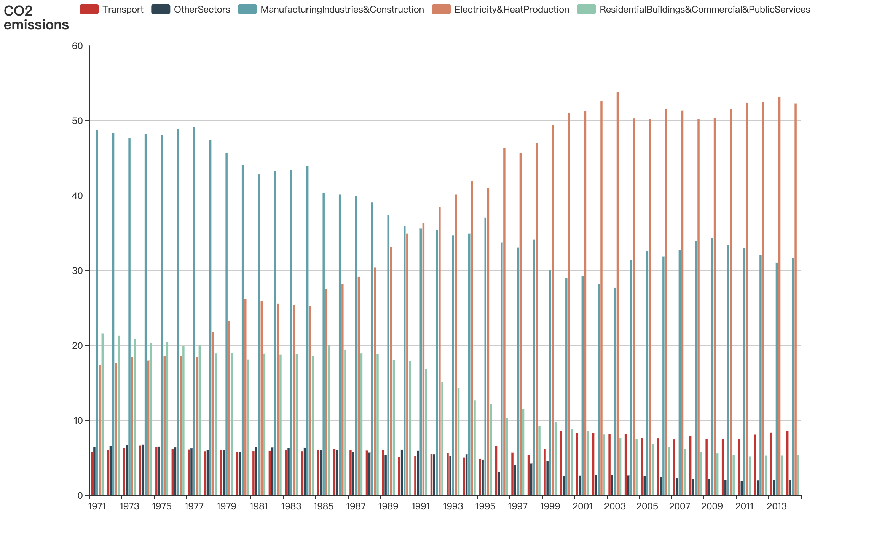
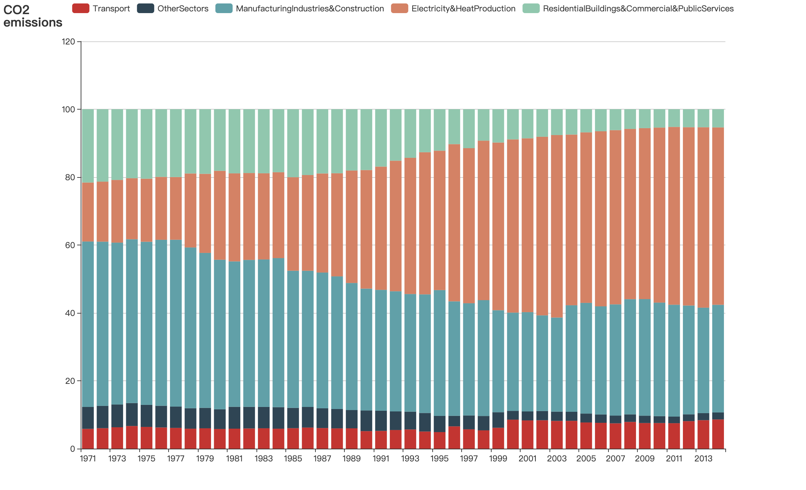

#探索性数据分析作业报告

软工2班 3017218092 侯雨茜

##一、数据集：1960-2017年世界银行数据

该数据集包含自1960年至2017年以来，世界银行收集的全球人类发展的数据。该数据通过气候变化，经济，教育，环境，性别平等，健康和科学技术等20项指标跟踪了全球人类的发展，覆盖了世界上不同的国家和地区。

数据可作为[csv](https://github.com/ZeningQu/World-Bank-Data-by-Indicators)在线获取。

## 二、初步分析问题

随着中国经济的迅速发展，中国的国际地位也显著提高，随之而来的，是环境和气候问题日益严峻，经济增长对环境造成的破坏已不容忽视。

20世纪60年代，邓小平同志的一句话：“不管黑猫白猫，能捉老鼠的就是好猫”，开启了中国20多年的飞速发展。这20多年来，中国成功地使4亿赤贫人口脱贫，国力日渐增强，成为世界各国都不能忽视的一个全球性大国。然而，在只顾发展的同时，我国的大气污染、 水环境污染、 土地荒漠化等环境问题日益严峻。

1980年，国际自然保护同盟的《世界自然资源保护大纲》中提到：“必须研究自然的、社会的、生态的、经济的以及利用自然资源过程中的基本关系，以确保全球的可持续发展。”1992年6月，联合国在里约热内卢召开的“环境与发展大会”，通过了以可持续发展为核心的《里约环境与发展宣言》、《21世纪议程》等文件。随后，中国政府编制了《中国21世纪人口、资源、环境与发展白皮书》，首次把可持续发展战略纳入我国经济和社会发展的长远规划。2002年，中共十六大把“可持续发展能力不断增强”作为全面建设小康社会的目标之一。从忽略环境保护受到自然界惩罚，到最终选择可持续发展，是中国社会发展的一次重大转折。

1. 首要问题：中国经济发展对环境的影响有多大？
2. 中国三大产业在不同时间内占据的比例如何？其分别对环境的影响有多大？
3. 环境和气候变化对中国的经济发展产生的制约？
4. 在未来，如何降低在经济发展过程中对环境的破坏，实现我国的可持续发展？

## 三、发现与见解

我们的分析从绘制各个变量的图开始，以评估分布和数据质量。随着我们的进步，我们为分析问题建立了多维视图。

###3.1 中国经济增长状况

GDP (current US$)

.png)

GDP per capita (current US$)

.png)

**交互方式：将光标至于坐标点上时，该点出现放大动效。**

上图是1960至2018年以来中国的GDP及人均GDP的变化折线图。由该图可以看出，中国的GDP水平一直处于增长的状态。特别是进入21世纪以来，国民生产总值飞速增长。2010年，中国的国民生产总值已取代日本，成为世界第二大经济体。2018年，中国的GDP已达到90.03万亿人民币。

###3.2 中国土地资源利用情况

Land Area

图3-1

图3-2

**交互方式：当光标移至某一柱状图时，会出现该项的具体数值和所表示的含义。在在网页中，右上角的工具栏可切换为平铺模式（图3-1）、堆叠模式（图3-2）或数据表模式，还可框选某一柱状图进行查看。**

**数据：数据来源于World Bank提供的中国的数据，经筛选后存放于`data/Land Area.xlsx`中，使用时需先打开数据表模式，将数据复制到其中，再刷新即可。**

由于中国是一个农业大国，第一产业在GDP中仍占有非常大的比重。因此，分析农业对环境造成的影响可以直观地看出中国经济发展对环境与气候的影响。接下来，我们分析一下中国的农业用地和森林面积自1990年以来在国土面积中占比的变化。由于世界银行没有给出1990年之前森林面积的数据，因此，我们选择1990年之后的土地数据来进行对比分析。在该图中，红色表示永久农耕用地的占比，深蓝色表示耕种用地的占比，浅蓝色表示农业用地的占比，橙色表示森林面积的占比。

可以看出，农业用地和森林面积的占比总和是在缓慢增长的，这表示我国的土地利用率处于增长状态，荒地、盐碱地、沙漠等以前难以利用的土地类型得到了开发。

除此之外，我们还能发现，直至2015年，耕种用地面积占比在缩小，而森林面积在逐步增大。这说明，我国在农业和经济的发展中已经渐渐意识到过多的开垦和耕种会对环境造成不利影响，保护森林的自然生态环境，才有利于可持续发展。

由于中国独特的地形和气候，中国森林资源的特点是面积小，资源数量少，地区分布不均。1990年，中国森林面积为1.246亿公顷，人均面积约0.107公顷，而全世界森林面积约40.19亿公顷，人均面积约0.8公顷。中国森林覆盖率12.98%,而全世界森林覆盖率为31%。

根据第八次全国森林资源清查结果得知，直至2013年，全国森林面积2.08亿公顷，森林覆盖率21.63%，森林蓄积151.37亿立方米。天然林面积1.22亿公顷，蓄积122.96亿立方米；人工林面积0.69亿公顷，蓄积24.83亿立方米。森林面积和森林蓄积分别位居世界第5位和第6位，人工林面积居世界首位。清查结果同样也证明了，我国森林资源呈现出数量持续增加、质量稳步提升、效能不断增强的良好态势。

###3.3 中国产业结构组成及变化

现在，我们来分析一下中国自1960年以来产业结构的变化。

Summary of Exports

**交互方式：将光标至于气泡上时会出现该项表示的年份和具体数值。**

上图是中国自1960以来对外出口的产品类型变化总和。由于Merchandise项和Goods项数值过大，我将其数值气泡与其他相比缩小了10倍。图上数值需乘上左边所表示的科学计数法的值。

由上图可知，自1960年以来，我国的商业、服务业、高新技术产业的出口值都在增大。进入21世纪后，我国在商品货物的出口方面所占的收入比例是非常大的，且一直处于稳步增长的状态。这充分说明，我国的商品制造业非常发达，占据了我国出口贸易的主导地位，"中国制造"领先全球。但是许多制造业可能会产生许多重污染的废气废料，在我们享受"中国制造"带来的红利的同时，我们也对环境造成了严重的污染。

由于高新技术出口数据有所缺失，世界银行只给出了2006年之后的数据，但我们仍然可以看出，在最近的十几年中，中国的高新技术产业迅猛发展，中国从原来的"中国制造"一步步走向了"中国创造"，产业结构也逐渐向环境友好型发展。

2018年中国产业结构图

**该图使用D3绘制**

**交互方式：将光标至于其中一个扇区上时，会出现该扇区对应的文字说明。将扇区拖走可实现扇区的删除，饼状图内仅由剩下的部分组成。**

由以上中国产业结构图可知，2018年，我国制造业占24.1%，工业占33.3%，服务业占42.7%。中国的服务业已占据了大头。在建国之初，我国是个典型的农业国，改革开放以来，我国产业结构逐渐趋于合理，并向优化和升级的方向发展。

自建国以来，我国GDP生产结构中的三次产业结构变化，同样也印证了以下几个特点：

1. 我国第一产业比重下降，而第二产业、第三产业比重上升。从增加值的比重变化上看，国民经济总量增长从主要由第一、二产业带动转为主要由第二、三产业带动。
2. 第二产业特别是工业的增长成为中国经济快速增长的主要动力之一。
3. 目前我国产业结构中第一、第二产业比重偏高，第三产业比重明显偏低，而且内部结构不合理、效益偏低。与世界大部分国家相比，我国第三产业增加值在GDP中所占比重仍然偏低。

###3.4 中国碳排放变化及原因分析

CO$_2$ emissions

图3-3

图3-4

**交互方式：当光标移至某一柱状图时，会出现该项的具体数值和所表示的含义。在在网页中，右上角的工具栏可切换为平铺模式（图3-3）、堆叠模式（图3-4）或数据表模式。**

**数据：数据来源于World Bank提供的中国的数据，经筛选后存放于`data/CO2.xlsx`中，使用时需先打开数据表模式，将数据复制到其中，再刷新即可。**

由上图可以看出，自1971年以来，随着中国社会的发展和产业结构的变化，中国不同原因的碳排放量也产生了相应变化。

对于交通方面，虽然碳排放量呈上升趋势，但是其增速并不快，处于一个较为稳定的状态。虽然随着经济的发展，人们的生活越来越富裕，出行时更多人会选择开私家车、乘飞机等碳排放较高的交通方式，但由于中国的公交、地铁、高铁、共享单车等公共交通设施较为发达，人们大多数时候还是会选择更为经济、低碳、便捷的公共交通。因此，在交通方面，人们对环境的影响不大。

对于工业和制造业方面，我国的碳排放量有显著降低。原因在3.3节中的分析中也可看出来，中国的产业结构正在向环境友好型的方向转型，逐渐趋于合理，并向优化和升级的方向发展。与此同时，随着科学技术的发展，传统工业和制造业中一些污染较大的部分，逐渐被更环保的工艺和原材料取代，这使得第二产业对环境的污染越来越小。

而对于电能和热能的生产方面，二氧化碳的排放量在显著增加。一方面，是由于人口增长，人们对能源的需求越来越高。另一方面，是随着科学技术的发展，越来越多的高科技电子产品走进人民的生活，人们的工作、学习及娱乐时间变长，对电子产品的依赖也越来越大，这使得电能及热能的消耗变多，导致碳排放增多。

## 四、总结

中国经济发展对环境的影响还是非常大的，且工业和制造业对环境的破坏较为严重。但是，随着中国经济的转型，中国的经济发展对环境对影响在逐渐降低，因此，环境和气候变化对中国经济的发展的制约并不明显。在未来，我们应当坚持中国特色社会主义事业"五位一体"的总体布局。要坚持新发展理念，建设现代化经济体系，以供给侧结构性改革为主线，推动经济发展质量变革、效率变革、动力变革，不断解放和发展社会生产力。要坚持在发展中保障和改善民生，在发展中补齐民生短板、促进社会公平正义，在幼有所育、学有所教、劳有所得、病有所医、老有所养、住有所居、弱有所扶上不断取得新进展。要坚持人与自然和谐共生，形成节约资源和保护环境的空间格局、产业结构、生产方式、生活方式，还自然以宁静、和谐、美丽。

**为方便检查，源数据及筛选后的数据均保存于`data`目录下，所生成的图片保存至`img`目录下，源代码保存于`worldBank`目录下，交互视频保存于`交互效果`目录下。**